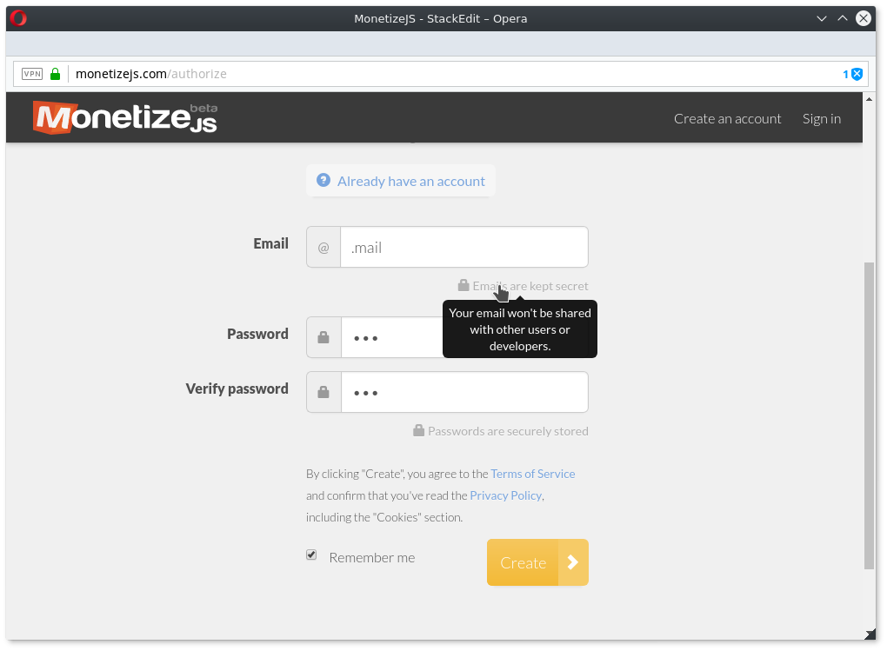
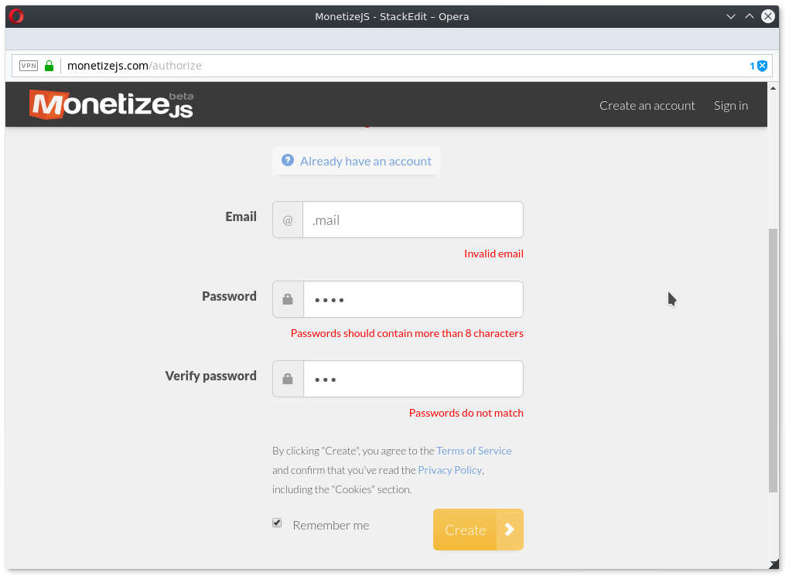

# U04: Heuristiken
## Übersetzung
### Error prevention
Even better than good error messages is a careful design which prevents a problem from occurring in the first place. Either eliminate error-prone conditions or check for them and present users with a confirmation option before they commit to the action.

### Fehlervermeidung
Es ist besser Information zu Problemen bereits vor dem Auftreten eines Fehlers anzuzeigen.

## Beispiel
### Keine Reaktion auf falsche Eingaben

Wie man sieht werden falsche Eingaben nicht vor dem Absenden des Formulars behandelt, womit die Seite der Heuristik der "Fehlervermeidung" widerspricht.

### Verbesserte Version

Über die Opera Developer Tools wurde ein Script eingespielt welches diesen Fehler behebt und bereits auf der Client Seite auf ungültige Eingaben noch während der Eingabe gibt.
