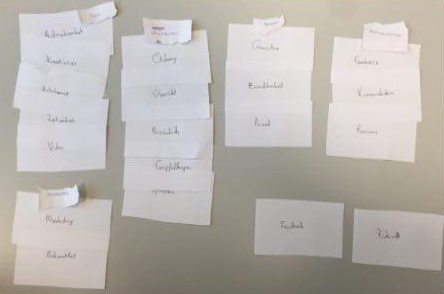
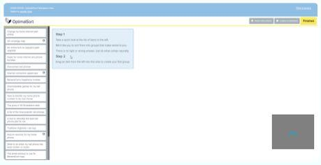

# Card Sorting Durchführung
Ich habe mich mit meinem Team und einem Kollegen zusammengesetzt und letzteren die Karten sortieren lassen.

Bei unserer Website ging es um eine Video-Plattform wie YouTube.

Der Kollege hat die Karten ähnlich sortiert wie erwartet, wobei 5 Kategorien erstellt wurden und 2 Karten keiner dieser Kategorien zugeordnet wurden. Unter den Kategorien waren meist: Kommunikation, Inhalt und Marketing.

## Erweiterung
Getestet wurde von meinem Team das Tool OptimalSort, während ich selbst Trello verwendet hatte.
Trello erlaubt das erstellen und drucken von Karten, mit angepassten Felder und Farben, wodurch sich Card Sorting einfach vorbereiten lässt.

OptimalSort funktioniert ähnlich, jedoch ist dieses speziell auf Card Sorting ausgelegt.

